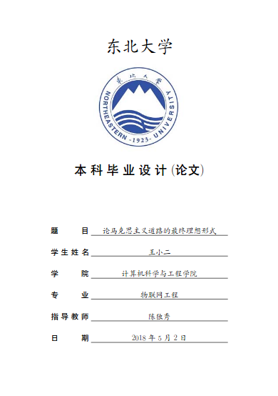

NEUBachelorThesis
=================
Introduction
------------
东北大学本科毕业设计论文模板

Requires
--------
TexLive 2017  
VSCode+LaTeX Workshop(Alternative)

Instructions
------------
    xelatex main.tex  
    bibtex  main.aux  
    xelatex main.tex  
    xelatex main.tex  

如果用的是VSCode编辑器+LaTex Workshop插件,可以直接将[vscode_setting.json](vscode_setting.json)的文件花括号中的内容添加到用户设置（Ctrl+,）中,这样在每次保存tex文件后，会自动执行以上编译步骤。或通过（Ctrl+Alt+B）快捷键手动编译。

Preview
-------
