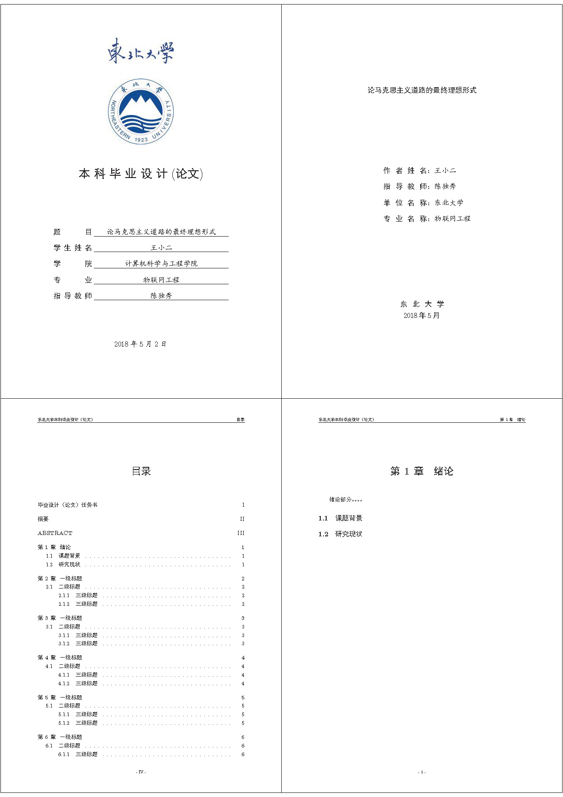

NEUBachelorThesis
=================

东北大学本科毕业设计论文模板

工作环境
--------
TexLive 2017  
VSCode+LaTeX Workshop(Alternative)

编译指令
------------
    xelatex main.tex  
    bibtex  main.aux  
    xelatex main.tex  
    xelatex main.tex  

如果用的是VSCode编辑器+LaTex Workshop插件,可以直接将[vscode_setting.json](vscode_setting.json)的文件花括号中的内容添加到用户设置（Ctrl+,）中,这样在每次保存tex文件后，会自动执行以上编译步骤。或通过（Ctrl+Alt+B）快捷键手动编译。

#### [点击此处预览](main.pdf)

使用说明
-------
* 插入公式：\insertmath{公式}  
* 插入图片：
    1. \insertpic{图片路径}{图片标题}(图片宽度固定为14.5cm)
    2. 使用latex默认插入图片的方式，可自定义控制图片大小。
* 插入三线表：格式文件中已经包含了对三线表支持的宏包，正常插入表格的方式即可。
* 封面与扉页：分别在data/cover.tex和data/titlepage.tex文件中按示例修改相关参数项即可。封面中，如果题目内容过长，可适当增大NEUBachelorThesis.cls文件中的\@title@width值，以增长下划线长度，此值默认大小为24em。
* 插入任务书：任务书是直接以pdf的形式加载到latex中编译的，我们只需要将任务书在word中填好后，转成pdf文件，命名为task.pdf后放入到data目录中即可。
* 引用参考文献：
    1. 建立文献库：从数据库中（如IEEE）找到要引用的论文，下载引用文件Bibtex，并将其中的内容复制添加到/ref/refs.bib中。
    2. 引用：在正文中使用\cite{refs.bib文件中的文献id名}即可完成论文引用，并自动生成参考文献条目。